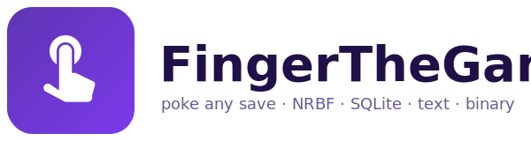

<p align="center">
  
</p>

# FingerTheGame

**Cheat at your Android games. No root.**

One-tap recipes for supported titles ("Max Money in Real War"), full save editor for everything else.
Works on stock Android 11+ via [Shizuku](https://shizuku.rikka.app/).

> ⚠️ Single-player only. Don't use this on online/multiplayer games — your account will get banned and that's
> on you. Don't point it at banking, auth, or anything that handles real money.

## Get it

Download the latest **APK** from the [Releases page](https://github.com/FZ1010/FingerTheGame/releases/latest)
and sideload it. (Sideload setup → see "[Install](#install)" below if you've never done that on your phone.)

## What you can do tonight

### One-tap recipes (the easy way)

If you have one of the supported games installed, FingerTheGame's home screen shows a recipe card for it.
Tap **Apply** and you're done — no understanding of save formats required.

Currently shipped recipes (more welcome via PR — see [Contributing recipes](#contributing-recipes)):

- **Real War** — Max Money / Skipits / Gems / All Upgrades / The Works (one tap, all of the above)

A recipe is a tiny JSON file telling FingerTheGame "in this game's save, find these fields and set them to
these values." Adding a new game = adding a JSON file.

### Manual editor (the everything-else way)

Pick any installed app from the picker → browse to its save file → edit. The editor auto-detects:

- **NRBF (.NET BinaryFormatter)** — Unity / Mono games. Every primitive parsed, grouped by class, named
  even when the game wraps everything in `Observable<T>` or buries values inside `BigInteger`/`Decimal`.
- **Protobuf** — schema-less wire-format walker. Works on any `.pb` file without `.proto` definitions.
- **Base64-wrapped** versions of either — auto-decoded on read, re-encoded on save.
- **JSON / XML** — syntax-aware editor.
- **SQLite** — row-level table editor.
- Anything else — hex viewer.

Smart helpers in the NRBF/Protobuf editors:

- **🔥 / 📈 / 💯 badges** flag fields whose names hit cheat keywords (in 9 languages), whose values are large
  (≥ 1M), or whose values are round-looking (1000, 5000, …).
- **By Value section** ranks the largest numeric fields when keyword scoring fails — your lifeline for
  obfuscated saves.
- **Compare** action diffs the current save against any backup or sibling slot. Pick the changes you want
  pulled in. Pairing is by byte offset so it works through obfuscated/non-English names.
- **Recents** on the home screen reopens recently-edited files in one tap.

### Save / restore

Every save backs up the original to this app's cache before overwriting. The target app gets force-stopped
first so it reloads cleanly from disk. Writes are **atomic**: staged to a `.tmp` and `mv`'d into place, so a
mid-write crash leaves the original intact.

## Install

### 1 · Download the APK
Grab `app-release.apk` from the
[**Releases page**](https://github.com/FZ1010/FingerTheGame/releases/latest).

### 2 · Allow sideloading on your phone
**Settings → Apps → Special access → Install unknown apps**, find your file manager / browser, turn on
**Allow from this source**.

### 3 · Install Shizuku
FingerTheGame talks to other apps' files through Shizuku. Without it, Android won't let one app read
another app's save data.

- Get **Shizuku** from the
  [Play Store](https://play.google.com/store/apps/details?id=moe.shizuku.privileged.api) or
  [GitHub](https://github.com/RikkaApps/Shizuku/releases/latest).
- Open Shizuku and follow its setup — easiest is **Wireless debugging** (no PC needed). One-time per phone.
- Confirm "Shizuku is running" at the top of the Shizuku app.

> If your phone reboots, Shizuku's wireless-debugging connection drops and needs to be re-paired in the
> Shizuku app. There's no fix for that — it's an Android limitation.

### 4 · Install FingerTheGame
Open the APK on your phone, tap **Install**.

### 5 · Grant permission
Open **FingerTheGame**. The home shows the Shizuku status — tap **Grant** if it asks, then **Allow** in the
popup. Status should read "Shizuku: ready".

### 6 · Cheat
- If your game has a recipe → tap it on the home screen. Done.
- Otherwise → **Browse all installed apps** → pick the game → browse to `files/` → open the save file →
  edit. Use **Save** when ready.

## Contributing recipes

The fastest way to grow this project is recipes. Open a PR adding `app/src/main/assets/recipes/<package>.json`:

```json
{
  "package": "com.example.yourgame",
  "label": "Your Game",
  "version": 1,
  "recipes": [
    {
      "id": "max_money",
      "title": "💰 Max Money",
      "description": "Sets coin balance to 1,000,000,000",
      "files": [
        {
          "relativePath": "files/save.dat",
          "format": "NRBF",
          "edits": [
            { "matchDisplayName": "coinAmount", "value": "1000000000" }
          ]
        }
      ]
    }
  ]
}
```

`matchDisplayName` is a case-insensitive substring of the field's display name as the editor renders it
(usually the property name, with `<…>k__BackingField` stripped). Use the manual editor first to find what
the field is actually called.

## How it works (deep dive)

### NRBF editor

The .NET BinaryFormatter parser walks the entire file and records every primitive's byte offset. Edits patch
the existing buffer in place rather than re-serialising, so layout-changing operations (resizing strings, growing
arrays) are intentionally not exposed.

**Auto-collapsing wrapper structures.** NRBF burdens many values inside structural noise:

- `System.Numerics.BigInteger` (`_sign` + `_bits`) → single decoded number
- `System.Decimal` (4 packed Int32s) → editable BigDecimal
- `System.DateTime` (Int64 dateData with Kind bits) → ISO-8601, Kind preserved on write
- `System.TimeSpan` (Int64 ticks) → ISO-8601 duration
- `KeyValuePair` dictionary entries get their key in the row label (`[5] = 0.75`)
- `Observable<T>` / single-field wrappers borrow the meaningful name from the closest non-generic ancestor by
  walking the inline context stack and the forward-reference graph

**Field organisation:**

- **⭐ Likely Cheat Targets** — cross-class section ranking fields by name + value heuristics
- **🔢 By Value (largest first)** — fallback when keyword scoring finds nothing
- **📦 \<ClassName\>** — every actual class in the file, "interesting" classes open by default
- **🛠 System.\*** — collection types pushed to the bottom

### Protobuf editor

Schema-less wire-format walker. Auto-detects only when an end-to-end parse succeeds with sane field numbers.
Editable: varints (when same byte-length), fixed32, fixed64. Length-delimited blobs editable when the new
content is exactly the same byte size.

### Two-save diff

Pairs by byte offset so it works through obfuscated / non-English names. Compose the current save with any
sibling file or app backup; pick the changes you want.

### Architecture notes

- Reads/writes go through `Shizuku.newProcess` (reflective — public Shizuku API doesn't expose it). Multi-MB
  writes pipe through stdin instead of being embedded in argv to dodge `ARG_MAX`. Atomic via stage-then-mv.
- Editors parse on `Dispatchers.Default`, debounce patch-application by 250 ms, lazy-render rows.
- All shell calls drain stdout + stderr concurrently to avoid the chatty-stderr pipe-fill deadlock.
- Path-taking calls reject `\n` / `\0` / control bytes / `..` segments before reaching a shell. Writes are
  confined to `/sdcard/Android/data/<selectedPkg>/`.
- Force-stop denylist for system / Play Store / Shizuku / banking-prefixed packages.
- 64 MB hard cap on file reads (OOM guard), 10 MB warning.
- A standalone `parser_test/` JVM project lets you reproduce format issues without an emulator:
  ```
  kotlinc parser_test/Main.kt parser_test/Crash.kt -include-runtime -d /tmp/crash.jar
  java -jar /tmp/crash.jar path/to/save.bin
  ```

## Building from source

```bash
gradle :app:assembleDebug
adb install -r --user 0 app/build/outputs/apk/debug/app-debug.apk
```

`--user 0` matters on devices with Samsung Dual Messenger (user 95) — without it Android may pick a profile
and install twice.

## Caveats

- String / variable-length-blob editing is intentionally disabled — would shift later byte offsets.
- The NRBF parser is best-effort: an unknown record type stops the walk and the editor shows what was
  collected before that point.
- Protobuf detection is heuristic. False positives are possible in theory; in practice the
  "must parse to end with sane field numbers" filter rejects anything that isn't actually protobuf.
- No root, no Frida, no live memory scanning — this only edits files. Anti-cheat detection on the file isn't
  defeated; that's not the goal.
- `/data/data/<pkg>/` (where `shared_prefs/` and many SQLite databases live) is unreachable through Shizuku's
  shell uid on stock Android 11+. We can only see what's exposed under `/sdcard/Android/data/<pkg>/`.

## License

Source-available — see [LICENSE](LICENSE). Short version: free to use, **not** for sale, **not** for
redistribution or rebranding, contributions back to this repo are welcome.
